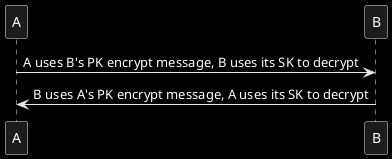

# RSA and AES

## 1. RSA
- Public key (PK) encrypt and private key (SK) decrypt, or private key encrypt and public key decrypt.
- Private key for self only and public key for others.
- Length of encryptive content is 128, so RSA always used for AES key.


- Generate Public Key and Private Key
```java
KeyPairGenerator keyPairGenerator = KeyPairGenerator.getInstance("RSA");
keyPairGenerator.initialize(1024);
KeyPair keyPair = keyPairGenerator.generateKeyPair();
PublicKey publicKey = keyPair.getPublic();
PrivateKey privateKey = keyPair.getPrivate();
```

- Encrypt and Decrypt
```java
// Public Key Encrypt
Cipher cipher = Cipher.getInstance("RSA");
cipher.init(Cipher.ENCRYPT_MODE, publicKey);
cipher.doFinal(content);
// Private Key Decrypt
Cipher cipher = Cipher.getInstance("RSA");
cipher.init(Cipher.DECRYPT_MODE, privateKey);
cipher.doFinal(code);

// Private Key Encrypt
Cipher cipher = Cipher.getInstance("RSA");
cipher.init(Cipher.ENCRYPT_MODE, privateKey);
cipher.doFinal(content);
// Public Key Decrypt
Cipher cipher = Cipher.getInstance("RSA");
cipher.init(Cipher.DECRYPT_MODE, publicKey);
cipher.doFinal(code);
```
trans key to byte[] (take easy to storing)
```java 
// trans to byte[]
byte[] pk = publicKey.getEncoded();
byte[] sk = privateKey.getEncoded();

// retrans form byte[]
PublicKey publicKey = KeyFactory.getInstance("RSA").generatePublic(new X509EncodedKeySpec(pk));
PrivateKey privateKey = KeyFactory.getInstance("RSA").generatePrivate(new PKCS8EncodedKeySpec(sk));
```

## 2. AES
- length of key cloud be: 128, 192, 256

- Generate random AES key
```java
KeyGenerator keyGenerator = KeyGenerator.getInstance("AES");
keyGenerator.init(128, new SecureRandom());
SecretKey secretKey = keyGenerator.generateKey();
```

- Use PBE to generate state aes key according to password and salt.
```java
SecretKey secretKey = SecretKeyFactory.getInstance("PBKDF2WithHmacSHA1").generateSecret(
        new PBEKeySpec(password.toCharArray(), salt.getBytes(StandardCharsets.UTF_8), 1000, 128)
);
```

- Encrypt and Decrypt
  - iv: third param of cipher.init(), prevent that same content are encrypted to same result, always set to random.
  - ECB Mode do not need iv.
  - CBC Mode need same iv when encrypting and decrypting, available to get iv from cipher.getIV().
```java
// encrypt
Cipher cipher = Cipher.getInstance("AES/ECB/PKCS5Padding");
cipher.init(Cipher.ENCRYPT_MODE, aesKey);
cipher.doFinal(content);

// decrypt
Cipher cipher = Cipher.getInstance("AES/ECB/PKCS5Padding");
cipher.init(Cipher.DECRYPT_MODE, aesKey);
cipher.doFinal(content);
```

## 3. Util of AES and RSA Crypt
```java
public class CryptoUtils {

    private static final String RSA = "RSA";
    private static final String AES = "AES";
    private static final String AES_MODE_PADDING = "AES/ECB/PKCS5Padding";

    public static String encodeKeyToBase64(Key key) {
        return Base64.getEncoder().encodeToString(key.getEncoded());
    }

    /**
     * generate random aes key
     */
    public static Key generateAesKey() {
        try {
            KeyGenerator keyGenerator = KeyGenerator.getInstance(AES);
            keyGenerator.init(128, new SecureRandom());
            return keyGenerator.generateKey();
        } catch (NoSuchAlgorithmException e) {
            e.printStackTrace();
            return null;
        }
    }

    /**
     * generate stable aes key base on salt
     */
    public static Key generateAesKey(String password, String salt) {
        try {
            return SecretKeyFactory.getInstance("PBKDF2WithHmacSHA1").generateSecret(
                    new PBEKeySpec(password.toCharArray(), salt.getBytes(StandardCharsets.UTF_8), 1000, 128)
            );
        } catch (InvalidKeySpecException | NoSuchAlgorithmException e) {
            e.printStackTrace();
            return null;
        }
    }

    public static Key getAesKeyFromBase64(String base64) {
        return new SecretKeySpec(Base64.getDecoder().decode(base64), AES);
    }

    public static String encryptByAes(String source, Key key) {
        try {
            Cipher cipher = Cipher.getInstance(AES_MODE_PADDING);
            cipher.init(Cipher.ENCRYPT_MODE, key);
            return Base64.getEncoder().encodeToString(cipher.doFinal(source.getBytes()));
        } catch (NoSuchAlgorithmException | InvalidKeyException | NoSuchPaddingException | BadPaddingException | IllegalBlockSizeException e) {
            e.printStackTrace();
            return null;
        }
    }

    public static String decryptByAes(String base64, Key key) {
        try {
            Cipher cipher = Cipher.getInstance(AES_MODE_PADDING);
            cipher.init(Cipher.DECRYPT_MODE, key);
            return new String(cipher.doFinal(Base64.getDecoder().decode(base64)));
        } catch (NoSuchAlgorithmException | InvalidKeyException | NoSuchPaddingException | BadPaddingException | IllegalBlockSizeException e) {
            e.printStackTrace();
            return null;
        }
    }

    public static KeyPair generateRsaKeyPair() {
        try {
            KeyPairGenerator rsa = KeyPairGenerator.getInstance(RSA);
            rsa.initialize(1024);
            return rsa.generateKeyPair();
        } catch (NoSuchAlgorithmException e) {
            e.printStackTrace();
            return null;
        }
    }

    public static String encryptByRsaPublishKey(String source, PublicKey publicKey) {
        try {
            Cipher cipher = Cipher.getInstance(RSA);
            cipher.init(Cipher.ENCRYPT_MODE, publicKey);
            return Base64.getEncoder().encodeToString(cipher.doFinal(source.getBytes()));
        } catch (NoSuchAlgorithmException | NoSuchPaddingException | BadPaddingException | IllegalBlockSizeException | InvalidKeyException e) {
            e.printStackTrace();
            return null;
        }
    }

    public static byte[] decryptByRsaPrivateKey(String base64, PrivateKey privateKey) {
        try {
            Cipher cipher = Cipher.getInstance(RSA);
            cipher.init(Cipher.DECRYPT_MODE, privateKey);
            return cipher.doFinal(Base64.getDecoder().decode(base64));
        } catch (NoSuchAlgorithmException | NoSuchPaddingException | BadPaddingException | IllegalBlockSizeException | InvalidKeyException e) {
            e.printStackTrace();
            return null;
        }
    }

    public static String getPemPublicKey(Key key) {
        return getPemFormat(key, "RSA PUBLIC KEY");
    }

    public static String getPemPrivateKey(Key key) {
        return getPemFormat(key, "RSA PRIVATE KEY");
    }

    public static String getPemFormat(Key key, String name) {
        return "-----BEGIN " + name + "-----\r\n"
                + Base64.getMimeEncoder().encodeToString(key.getEncoded()) + "\r\n"
                + "-----END " + name + "-----\r\n";
    }

    public static String readKeyFromPem(String pem) {
        return pem.replaceAll("-----(BEGIN|END)(.*)-----", "").replaceAll("\\r\\n", "");
    }

    public static PublicKey decodeRsaPublicKeyFromBase64(String base64) {
        try {
            return KeyFactory.getInstance(RSA).generatePublic(new X509EncodedKeySpec(Base64.getDecoder().decode(base64)));
        } catch (InvalidKeySpecException | NoSuchAlgorithmException e) {
            e.printStackTrace();
            return null;
        }
    }

    public static PrivateKey decodeRsaPrivateKeyFromBase64(String base64) {
        try {
            return KeyFactory.getInstance(RSA).generatePrivate(new PKCS8EncodedKeySpec(Base64.getDecoder().decode(base64)));
        } catch (InvalidKeySpecException | NoSuchAlgorithmException e) {
            e.printStackTrace();
            return null;
        }
    }
}
```
