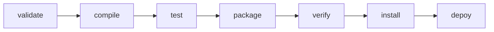

# 自定义Maven Plugin

1. 项目命名通常为 xxx-maven-plugin

2. pom.xml的打包类型为maven-plugin
```xml
<packaging>maven-plugin</packaging>
```

3. 依赖
```xml
<dependency>
    <groupId>org.apache.maven</groupId>
    <artifactId>maven-plugin-api</artifactId>
    <version></version>
</dependency>
<dependency>
    <groupId>org.apache.maven.plugin-tools</groupId>
    <artifactId>maven-plugin-annotations</artifactId>
    <version></version>
    <scope>provided</scope>
</dependency>
```

4. Mojo 相当于goal
```java
// goal名称、maven生命周期作用点
@Mojo(name = "goal-name", defaultPhase = LifecyclePhase)
public class ExMojo extends AbstractMojo {
    // 参数
    @Parameter(property = "param-name", defaultValue = "param-value")
    private String param;

    public void execute() {
        // ...

        // 打印日志
        getLog().info("");
    }
}
```

5. 命令mvn install可将插件安装到本地repository

6. 在其他项目中使用
```xml
<plugin>
    <groupId></groupId>
    <artifactId>xxx-maven-plugin</artifactId>
    <version></version>
    <executions>
        <execution>
            <goals>
                <goal>goal-name</goal>
            </goals>
            <configuration>
                <param-name>param-value</param-name>
            </configuration>
        </execution>
    </executions>
</plugin>
```

- Maven 的生命周期
  - 独立 clean site
  - default(build) 按照以下流程

