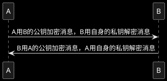

# RSA + AES

## 1. RSA非对称加密
公钥加密私钥解密，私钥加密公钥解密 <br/>
私钥自身保存，公钥公开 <br/>
加密内容的长度只能是128字节 <br/>


生成公钥、私钥
```java
KeyPairGenerator keyPairGenerator = KeyPairGenerator.getInstance("RSA");
keyPairGenerator.initialize(1024);
KeyPair keyPair = keyPairGenerator.generateKeyPair();
PublicKey publicKey = keyPair.getPublic();
PrivateKey privateKey = keyPair.getPrivate();
```

加密、解密
```java
// 公钥加密
Cipher cipher = Cipher.getInstance("RSA");
cipher.init(Cipher.ENCRYPT_MODE, publicKey);
cipher.doFinal(content);
// 私钥解密
Cipher cipher = Cipher.getInstance("RSA");
cipher.init(Cipher.DECRYPT_MODE, privateKey);
cipher.doFinal(code);

// 私钥加密
Cipher cipher = Cipher.getInstance("RSA");
cipher.init(Cipher.ENCRYPT_MODE, privateKey);
cipher.doFinal(content);
// 公钥解密
Cipher cipher = Cipher.getInstance("RSA");
cipher.init(Cipher.DECRYPT_MODE, publicKey);
cipher.doFinal(code);
```

密钥与byte[]相互转换，便于储存
```java 
// 转换为byte[]
byte[] pk = publicKey.getEncoded();
byte[] sk = privateKey.getEncoded();

// 从byte[]还原
PublicKey publicKey = KeyFactory.getInstance("RSA").generatePublic(new X509EncodedKeySpec(pk));
PrivateKey privateKey = KeyFactory.getInstance("RSA").generatePrivate(new PKCS8EncodedKeySpec(sk));
```

## 2. AES加密
可以生成128、192、256字节长度的密钥

随机生成AES密钥
```java
KeyGenerator keyGenerator = KeyGenerator.getInstance("AES");
keyGenerator.init(128, new SecureRandom());
SecretKey secretKey = keyGenerator.generateKey();
```

使用PBE算法根据密码和盐生成固定的密钥
```java
SecretKey secretKey = SecretKeyFactory.getInstance("PBKDF2WithHmacSHA1").generateSecret(
        new PBEKeySpec(password.toCharArray(), salt.getBytes(StandardCharsets.UTF_8), 1000, 128)
);
```

加密、解密 <br/>
iv参数：cipher.init()方法的第三个参数，防止相同内容每次加密后结果相同（理论上应该设置为随机值） <br/>
ECB模式下不需要此参数。 <br/>
CBC模式下加密解密需要使用相同的iv参数，可以通过cipher.getIV()获得。 <br/>
```java
// 加密
Cipher cipher = Cipher.getInstance("AES/ECB/PKCS5Padding");
cipher.init(Cipher.ENCRYPT_MODE, aesKey);
cipher.doFinal(content);

// 解密
Cipher cipher = Cipher.getInstance("AES/ECB/PKCS5Padding");
cipher.init(Cipher.DECRYPT_MODE, aesKey);
cipher.doFinal(content);
```

## 3. 通用工具类
```java
public class CryptUtil {

    private static final String RSA = "RSA";
    private static final String AES = "AES";
    private static final String AES_MODE_PADDING = "AES/ECB/PKCS5Padding";

    /**
     * 随机生成AES密钥
     *
     * @return 密钥
     */
    public static String generateAesKey() {
        try {
            KeyGenerator keyGenerator = KeyGenerator.getInstance(AES);
            keyGenerator.init(128, new SecureRandom());
            return Base64.getEncoder().encodeToString(keyGenerator.generateKey().getEncoded());
        } catch (NoSuchAlgorithmException e) {
            e.printStackTrace();
            return null;
        }
    }

    /**
     * 根据密码和盐生成固定的AES密钥
     *
     * @param password 密码
     * @param salt     盐
     * @return 密钥
     */
    public static String generateAesKey(String password, String salt) {
        try {
            return Base64.getEncoder().encodeToString(
                    SecretKeyFactory.getInstance("PBKDF2WithHmacSHA1").generateSecret(
                            new PBEKeySpec(password.toCharArray(), salt.getBytes(StandardCharsets.UTF_8), 1000, 128)
                    ).getEncoded());
        } catch (InvalidKeySpecException | NoSuchAlgorithmException e) {
            e.printStackTrace();
            return null;
        }
    }

    /**
     * AES加密
     *
     * @param source 加密内容
     * @param aesKey 密钥
     * @return 密文
     */
    public static String encryptByAes(String source, String aesKey) {
        try {
            Cipher cipher = Cipher.getInstance(AES_MODE_PADDING);
            cipher.init(Cipher.ENCRYPT_MODE, new SecretKeySpec(Base64.getDecoder().decode(aesKey), AES));
            return Base64.getEncoder().encodeToString(cipher.doFinal(source.getBytes()));
        } catch (NoSuchAlgorithmException | InvalidKeyException | NoSuchPaddingException | BadPaddingException | IllegalBlockSizeException e) {
            e.printStackTrace();
            return null;
        }
    }

    /**
     * AES解密
     *
     * @param base64 base64密文
     * @param aesKey 密钥
     * @return base64解密结果
     */
    public static String decryptByAes(String base64, String aesKey) {
        try {
            Cipher cipher = Cipher.getInstance(AES_MODE_PADDING);
            cipher.init(Cipher.DECRYPT_MODE, new SecretKeySpec(Base64.getDecoder().decode(aesKey), AES));
            return new String(cipher.doFinal(Base64.getDecoder().decode(base64)));
        } catch (NoSuchAlgorithmException | InvalidKeyException | NoSuchPaddingException | BadPaddingException | IllegalBlockSizeException e) {
            e.printStackTrace();
            return null;
        }
    }

    /**
     * 生成RSA密钥对
     *
     * @return 密钥对
     */
    public static KeyPair generateRsaKeyPair() {
        try {
            KeyPairGenerator rsa = KeyPairGenerator.getInstance(RSA);
            rsa.initialize(1024);
            return rsa.generateKeyPair();
        } catch (NoSuchAlgorithmException e) {
            e.printStackTrace();
            return null;
        }
    }

    /**
     * RSA公钥加密
     *
     * @param source    加密内容
     * @param publicKey 公钥
     * @return base64加密结果
     */
    public static String encryptByRsaPublishKey(byte[] source, PublicKey publicKey) {
        try {
            Cipher cipher = Cipher.getInstance(RSA);
            cipher.init(Cipher.ENCRYPT_MODE, publicKey);
            return Base64.getEncoder().encodeToString(cipher.doFinal(source));
        } catch (NoSuchAlgorithmException | NoSuchPaddingException | BadPaddingException | IllegalBlockSizeException | InvalidKeyException e) {
            e.printStackTrace();
            return null;
        }
    }

    /**
     * RSA私钥解密
     *
     * @param base64     base64
     * @param privateKey 私钥
     * @return 解密内容
     */
    public static byte[] decryptByRsaPrivateKey(String base64, PrivateKey privateKey) {
        try {
            Cipher cipher = Cipher.getInstance(RSA);
            cipher.init(Cipher.DECRYPT_MODE, privateKey);
            return cipher.doFinal(Base64.getDecoder().decode(base64));
        } catch (NoSuchAlgorithmException | NoSuchPaddingException | BadPaddingException | IllegalBlockSizeException | InvalidKeyException e) {
            e.printStackTrace();
            return null;
        }
    }

    /**
     * 将密钥转换为base64字符串
     *
     * @param key 密钥
     * @return base64字符串
     */
    public static String encodeKeyToBase64(Key key) {
        return Base64.getEncoder().encodeToString(key.getEncoded());
    }

    /**
     * 写密钥文件
     *
     * @param key      密钥
     * @param filePath 文件路径
     * @param title    标题
     * @throws IOException
     */
    public static void writeKeyFile(Key key, String filePath, String title) throws IOException {
        File file = new File(filePath);
        if (!file.exists() || !file.isFile()) file.createNewFile();
        String keyString = Base64.getEncoder().encodeToString(key.getEncoded());
        try (FileWriter writer = new FileWriter(file)) {
            writer.write("-----BEGIN " + title + "-----\n");
            if (keyString != null) {
                int index = 0;
                while (index < keyString.length()) {
                    if (index + 64 > keyString.length()) {
                        writer.write(keyString.substring(index) + "\n");
                    } else {
                        writer.write(keyString.substring(index, index + 64) + "\n");
                    }
                    index += 64;
                }
            }
            writer.write("-----END " + title + "-----\n");
        }
    }

    // 密钥文件的起始行与结束行
    private static final Pattern pattern = Pattern.compile("^-----(BEGIN|END)\\s(.*)-----$");

    /**
     * 从文件读取密钥
     *
     * @param filePath 文件路径
     * @return base64密钥
     * @throws IOException
     */
    public static String readKeyFromFile(String filePath) throws IOException {
        try (BufferedReader reader = new BufferedReader(new FileReader(filePath))) {
            StringBuilder builder = new StringBuilder();
            String buffer;
            while ((buffer = reader.readLine()) != null) {
                if (!pattern.matcher(buffer).find()) builder.append(buffer);
            }
            return builder.toString();
        }
    }

    /**
     * 从base64字符串还原公钥
     *
     * @param base64 base64字符串
     * @return 公钥
     */
    public static PublicKey decodeRsaPublicKeyFromBase64(String base64) {
        try {
            return KeyFactory.getInstance(RSA).generatePublic(new X509EncodedKeySpec(Base64.getDecoder().decode(base64)));
        } catch (InvalidKeySpecException | NoSuchAlgorithmException e) {
            e.printStackTrace();
            return null;
        }
    }

    /**
     * 从base64字符串还原私钥
     *
     * @param base64 base64字符串
     * @return 私钥
     */
    public static PrivateKey decodeRsaPrivateKeyFromBase64(String base64) {
        try {
            return KeyFactory.getInstance(RSA).generatePrivate(new PKCS8EncodedKeySpec(Base64.getDecoder().decode(base64)));
        } catch (InvalidKeySpecException | NoSuchAlgorithmException e) {
            e.printStackTrace();
            return null;
        }
    }
}
```
